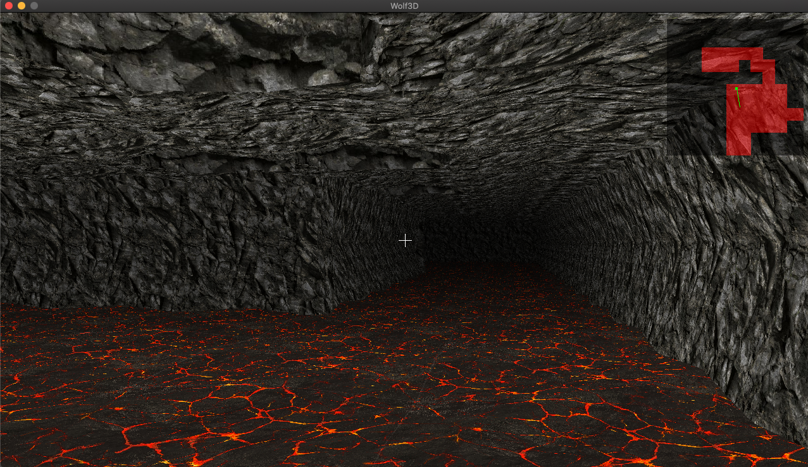
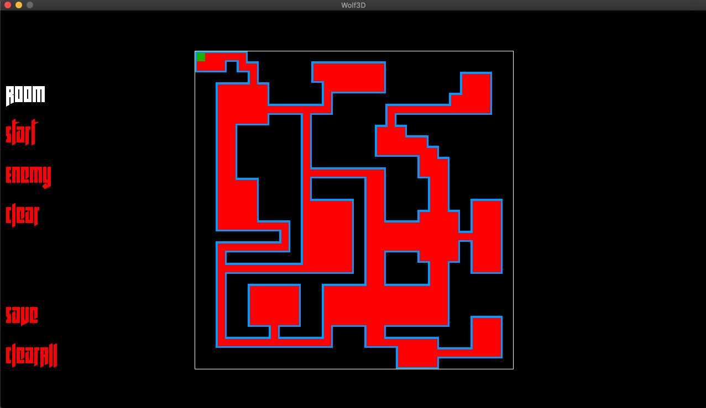

# Wolf3d (Software rasterizer)

A 3d software rasterizer engine written in C following 42-guidelines.
A raycast method is used for 3d effect.

Features:

- Raycasted 3D
- Parallel rendering
- Depth shading
- Option for simple normal mapping
- Map editor
- `.obj` file import and usage for world generation
  - homemade 3d models :)
- AABB collision (player)
- AABB viewbox occulsion
- Skybox
- Minimap



### Install (Mac)

```sh
git clone (repo-url) && cd (repo-folder)
make && ./wolf3d
```

### Install (Linux)
Install SDL2, SDL_image, SDL_ttf on linux. Easy way:
```sh
sudo apt update
sudo apt-get install libsdl2-dev
sudo apt-get install libsdl2-ttf-dev
sudo apt-get install libsdl2-image-dev
```
If above fails, install by hand. Hard way:
https://www.libsdl.org/download-2.0.php
https://www.libsdl.org/projects/SDL_ttf/ (needed `sudo apt-get install libfreetype6-dev` on my system)
https://www.libsdl.org/projects/SDL_image/

For each downloaded source code folder above
```sh
./configure
make
sudo make install
```

Then play the game :)
```sh
git clone (repo-url) && cd (repo-folder)
make && ./wolf3d
```

### Map Editor

A simple map editor to generate levels for wolf3d.



```sh
make map_editor && ./wolf3d_editor #default size of 15x15
./wolf3d_editor --filename=maps/map_name_here --size=1-50
```

Add your map file to `src/scene/scene_data.c`

```c
	data->map_filename = ft_strdup("maps/level1");
```

Then recompile

```
make && ./wolf3d
```

## Notes

### External libraries:

- SDL: Window management, fonts, events, time and presenting the framebuffer
  - All graphics are software rendered
- Libc:
  - `pthreads.h` for parallelization
  - `stdlib.h`: `malloc`, `free`, `exit`
  - `stdarg.h`: variable length inputs
  - `stdint.h` and `float.h`: types
  - `fcntl.h`: `open`, `close`

### Libraries specifically made for this:

- lib3d: 2D and 3D functionality, rasterization, 3d object representation & reading etc.
- libgmatrix: matrix and vector math library
- libft/hash_map
- libft/thread_pool
